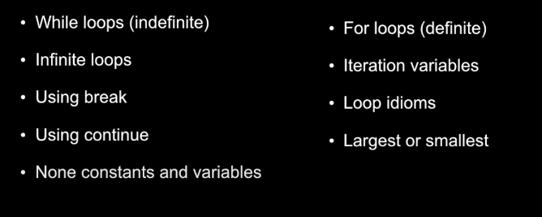

# PYTHON SOFTWARE ENGINEER
___
1. Variables
2. Expressions
3. Statements
4. Conditional Structures
5. More Conditional Structures
6. Built-In Functions
7. Build Our Own Function
8. Loops And Iterations
    -  Infinite Loop
    -  Continue an iteration
    -  Break outside of a loop
    -  Definite Loop

9. Strings
    - accessing character
    - strings slicing
    - The "in" logical operator
    - Strubgs built-in functions